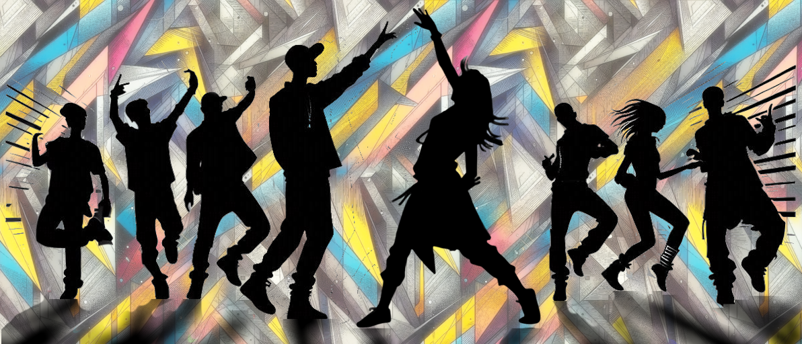

# Dance Corp

# 🎵 Summary

This app aims to recreate the StepMania experience with a fully recreated rhythm game engine, in a web browser.
It will provide precise gameplay mechanics, a balanced scoring system, and interactive feedback, exactly as in the original app.
With the possibility of web development may come new features as leaderboard, easy steps sharing, and maybe more

## 📌 Features already implemented
### Gameplay
✅ Tap notes
✅ Hold notes
❌ Roll notes
❌ Mines
❌ Fake
❌ Hidden

✅ Single Player
✅ Multi Player

### Visual & effects
✅ Note display
✅ Bar display
✅ Hud display

### Score
✅ Dynamic scoring system → Guarantees 1,000,000 points, accurately distributed across notes.
✅ Combo tracking →  rewarding consistent performance
❌ Combo does count in score

### Stats tracking
✅ Single player stats
❌ Multi Player stats

### Options 
✅ Gamepad assignation & keybinding
✅ Keyboard assignation & keybinding
✅ Training mode
✅ Display size

## 🛠️ App design
### Game 
 MVC pattern : 
  - gameModel with gameRound as main game loop
  - gameDisplay with a gameModel associated
  - gameController associated to a gameModel
  - and musicPlayer

### Pages 
Well ... the different app pages

### Services 
 Hold the services for the differents part of the app, mainly the database.

### Shared
 Shared component : the header, the guard ...
